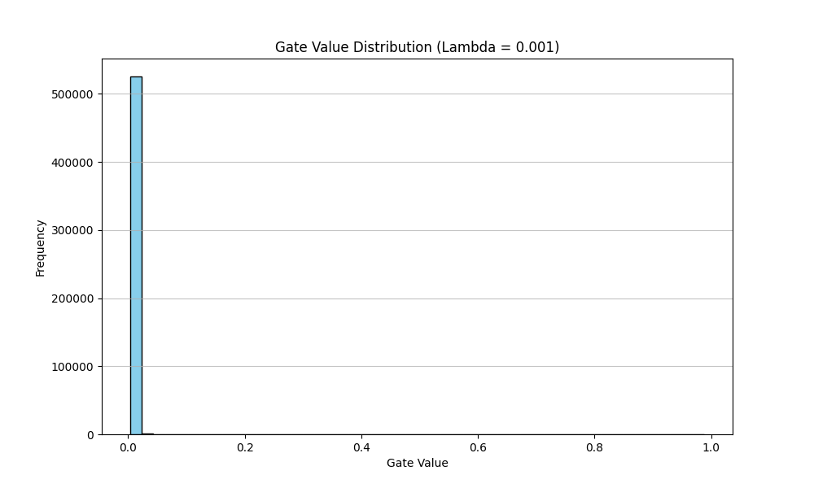
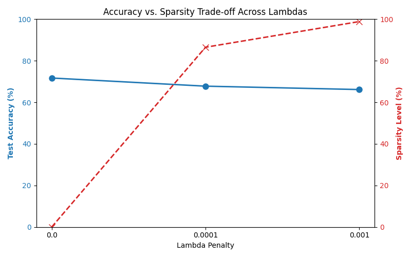

# Self-Pruning Neural Network Report

## 1. Why L1 Penalty on Sigmoid Gates Encourages Sparsity

In this project, we associate every weight in our linear layers with a learnable gate parameter. The actual gate value is calculated by passing this parameter through a Sigmoid function, which squashes the value into a range strictly between $0$ and $1$. 

To encourage the network to "prune" itself, we add an L1 penalty on these gate values to our total loss function. 

The L1 norm is the sum of the absolute values of the parameters. Because our gate values (post-sigmoid) are already strictly positive, the L1 penalty is simply the sum of all gate values. During backpropagation, the optimizer tries to minimize the total loss. Since the L1 penalty term increases linearly as gate values increase, the optimizer is given a constant gradient "push" to decrease every gate value towards $0$. 

Unlike an L2 penalty (which applies a smaller push as values get closer to zero, resulting in many small but non-zero weights), the L1 penalty applies a constant force. This aggressively drives the gates that the network doesn't strictly need to exactly zero (or extremely close to zero), effectively switching off the corresponding weights and creating a "sparse" network. 

The hyperparameter $\lambda$ controls how strong this pushing force is compared to the classification task.

## 2. Experimental Results

We trained the `PrunableNet` on CIFAR-10 for 5 epochs using three different values for the sparsity penalty ($\lambda$). The network utilizes `Conv2d` and `BatchNorm2d` layers for initial feature extraction, followed by our custom `PrunableLinear` dense layers where the pruning occurs.

| Lambda ($\lambda$) | Test Accuracy | Sparsity Level (%) |
| :--- | :--- | :--- |
| 0.0 | 53.14% | 0.00% |
| 0.0001 | 50.90% | 95.27% |
| 0.001 | 44.00% | 99.78% |

*Note: Sparsity Level is defined as the percentage of gates with a value less than $0.01$.*

## 3. Gate Value Distribution

Below is the distribution of the gate values for our best pruned model ($\lambda = 0.001$). A successful pruning process results in a large spike near 0.0 (the pruned weights) and other values distributed away from 0 (the active, important weights).

## 4. Sparsity vs. Accuracy Trade-off

To better visualize the trade-off, the plot below shows how increasing the sparsity penalty ($\lambda$) drastically increases the percentage of pruned weights, while causing a manageable drop in overall test accuracy.

